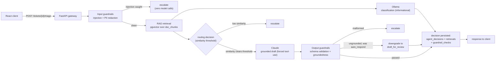
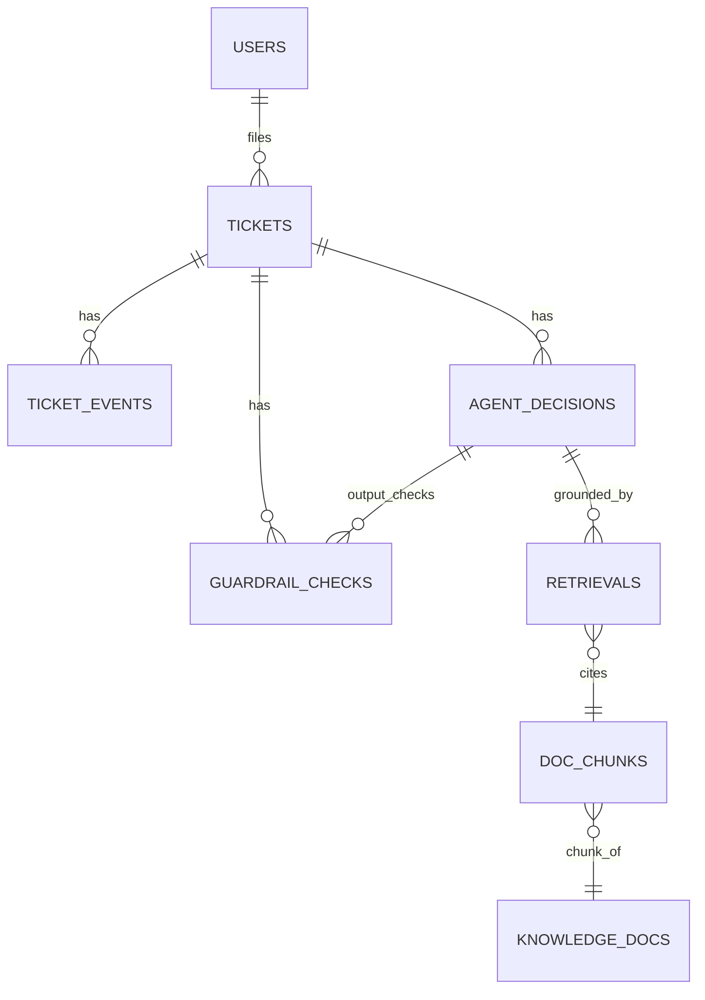

# System architecture

## Overview
A ticketing SaaS with an AI assistant embedded at the platform level.
Request flow: client → gateway → input guardrails → triage agent →
model router (Ollama or Claude) → output guardrails → response.

Every box past "Input guardrails" writes a real row (`agent_decisions`,
`retrievals`, `guardrail_checks`) — see Data model below and
`docs/results.md` for what's actually in those tables. Full reasoning
for this shape: ADR-0008 (pipeline order, why retrieval similarity
drives routing) and ADR-0009 (output guardrail enforcement).

## Components

**React client** — ticket UI, agent-assisted reply view.

**FastAPI gateway** — auth, ticket CRUD, request routing. Boring by
design; no AI logic lives here.

**Input guardrails** — injection detection and PII redaction run
before anything reaches a model or a log.

**Triage agent** — retrieves relevant context (RAG over
`doc_chunks`), decides whether to auto-respond, draft-for-review, or
escalate, and issues the model call.

**Model router** — sends routine classification to a quantized local
model via Ollama; sends complex draft generation to Claude. The
routing decision is a documented tradeoff (see `docs/adr/`), not a
default.

**Output guardrails** — validates the response against a schema,
checks it's grounded in the retrieved context (no unsupported claims),
and applies the confidence-based escalation threshold.

**Observability layer** — every model call is logged with latency,
token cost, and (where applicable) eval score. Not a separate hop in
the request path — it hooks into every component above.

## Data model
No separate ERD file — the original plan referenced one
(`docs/schema.md`) that was never actually committed; ADR-0004
superseded it with the schema design documented there plus the model
code itself (`backend/app/models/`). The relationships that matter for
the AI pipeline specifically:

(`golden_set` and `eval_runs` aren't ticket-scoped, so they're left off
this diagram — see `docs/results.md` for what's actually in `eval_runs`.)

Two design choices worth restating here (full reasoning in the ADRs):
- `agent_decisions.model_used` is logged per decision — this is what
  makes the Ollama-vs-Claude comparison possible (`docs/results.md`,
  `scripts/cost_report.py`).
- `guardrail_checks` is its own table, not a boolean flag, so results
  can be broken down by check type (see `docs/results.md`'s safety
  section for exactly that breakdown).

## Infrastructure
Everything runs under Docker Compose: `api`, `db` (Postgres +
pgvector), `ollama`, `frontend`. No local venv or ad hoc dependency
install — `docker compose up` is the only supported way to run this
locally.
